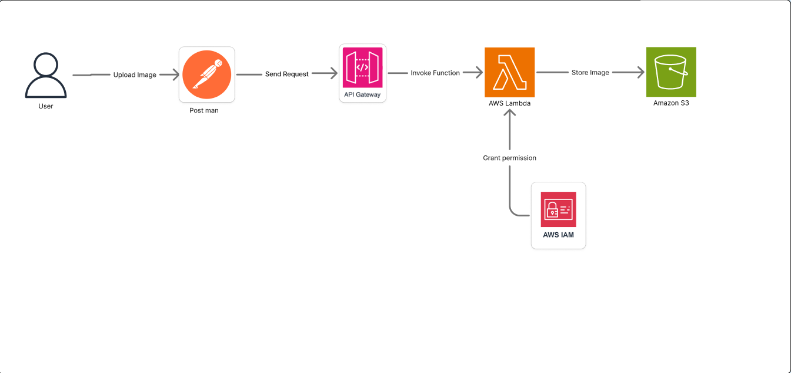

# Upload Image to S3 bằng API Gateway và Lambda

## 👨‍🎓 Thông Tin Sinh Viên Thực Tập

- **Họ và Tên**: Vũ Yên Định  
- **MSSV**: 2180602169  
- **Email**: vuyendinh999@gmail.com  
- **GitHub**: [https://github.com/yendinh2003](https://github.com/yendinh2003)

---

# 📄 1. Executive Summary

Việc lưu trữ hình ảnh là nhu cầu phổ biến trong các ứng dụng hiện đại, từ mạng xã hội, thương mại điện tử đến y tế và quản lý tài sản. Tuy nhiên, triển khai một hệ thống upload ảnh truyền thống yêu cầu chi phí vận hành backend và bảo trì cao.

Đề tài này hướng đến giải pháp **upload ảnh lên Amazon S3 thông qua AWS Lambda và API Gateway** – một mô hình serverless hiệu quả, tiết kiệm và dễ mở rộng. Hệ thống loại bỏ hoàn toàn nhu cầu chạy máy chủ backend truyền thống, tận dụng các dịch vụ AWS như S3, Lambda, API Gateway và IAM Role để đảm bảo tính bảo mật, hiệu năng và tiết kiệm chi phí.

### Problem Statement (Ngắn gọn)
Các hệ thống hiện tại tốn kém và phức tạp để xử lý upload ảnh. Cần một giải pháp đơn giản, bảo mật và tiết kiệm để xử lý ảnh từ frontend lên cloud.

### Solution Overview & Key Features
- Cho phép người dùng upload ảnh thông qua API HTTP POST.
- Tự động xử lý và lưu ảnh vào S3 bằng Lambda.
- Bảo mật thông qua IAM và phân quyền hạn chế.
- Hạ tầng **serverless 100%**, không cần backend.

### Business Benefits & ROI Summary
- Giảm chi phí backend đến 100% nhờ serverless.
- Tăng khả năng mở rộng không giới hạn.
- Triển khai nhanh, dễ tích hợp.
- ROI kỳ vọng đạt được sau 3-6 tháng áp dụng vào hệ thống thực tế.

### Investment Required & Timeline
- Không phát sinh chi phí (dưới mức Free Tier).
- Triển khai hoàn tất trong 3-4 tuần với 1 người thực hiện.

### Success Metrics & Expected Outcomes
- Ảnh được upload < 3 giây.
- Không có ảnh public ngoài ý muốn.
- Hệ thống hoạt động liên tục 24/7.
- Người dùng tích hợp dễ dàng với bất kỳ frontend nào.

---

# 🎯 2. Problem Statement

## 2.1 Current Situation Analysis
Hiện tại việc lưu trữ ảnh thường dùng backend xử lý (PHP, Node.js...) với chi phí vận hành, bảo trì và bảo mật cao. Khi cần mở rộng quy mô hoặc giảm độ trễ, hệ thống truyền thống gặp hạn chế.

## 2.2 Pain Points Identification
- Tốn thời gian phát triển backend xử lý ảnh.
- Khó bảo trì nếu team nhỏ hoặc thiếu DevOps.
- Không tận dụng được AWS Free Tier.
- Backend dễ bị tấn công (upload shell, vượt kiểm tra kích thước ảnh).

## 2.3 Stakeholders Affected
| Đối tượng        | Mối quan tâm |
|------------------|--------------|
| Developer        | Muốn giảm workload và rủi ro |
| Doanh nghiệp     | Muốn tiết kiệm chi phí và mở rộng dễ |
| Người dùng cuối  | Muốn upload ảnh nhanh, an toàn |

## 2.4 Business Consequences of Inaction
- Tăng chi phí server không cần thiết.
- Chậm thời gian triển khai sản phẩm.
- Dễ gặp lỗi bảo mật.

## 2.5 Market Opportunity
Serverless đang là xu hướng với tăng trưởng 23%/năm. Việc chuyển qua mô hình không máy chủ cho phép startup và SME tiết kiệm chi phí và tăng tốc ra mắt sản phẩm.

---

# 🏗️ 3. Solution Architecture

## 3.1 High-level Architecture Diagram

## 3.2 AWS Services Selection
| Dịch vụ     | Lý do chọn |
|-------------|------------|
| Amazon S3   | Lưu ảnh, hỗ trợ lifecycle & versioning |
| Lambda      | Serverless, tiết kiệm, tự scale |
| API Gateway | Endpoint HTTP bảo mật & dễ tích hợp |
| IAM Role    | Phân quyền truy cập chính xác |

## 3.3 Component Interaction
- Người dùng gửi ảnh (base64/multipart) → API Gateway.
- API Gateway gọi Lambda → xử lý và lưu ảnh vào S3.
- Lambda trả URL hoặc response JSON.

## 3.4 Security Architecture & Compliance
- IAM Role chỉ cấp quyền `PutObject`.
- S3 block public access toàn bộ.
- Xác thực CORS nếu tích hợp frontend.

## 3.5 Scalability & Performance
- API Gateway & Lambda tự scale.
- Xử lý ảnh dung lượng < 6MB trong vòng < 3s.

## 3.6 Integration Points
- Có thể tích hợp vào bất kỳ frontend (React, Vue, mobile...).
- Có thể thêm watermark hoặc Rekognition sau.

---

# 🔧 4. Technical Implementation

## 4.1 Implementation Phases

1. Tạo IAM Role & Bucket S3
2. Viết Lambda Function (Node.js/Python)
3. Cấu hình API Gateway
4. Test Postman & hoàn thiện

## 4.2 Technical Requirements
- S3: 1 Bucket, block public access
- Lambda: 128MB RAM, timeout 10s
- API Gateway: HTTP API hoặc REST API

## 4.3 Development Approach
- TDD (test từng phần)
- Triển khai trực tiếp trên Console hoặc sử dụng SAM

## 4.4 Testing Strategy
- Postman để gửi ảnh
- Kiểm tra object metadata trong S3
- Xử lý file lớn, sai định dạng

## 4.5 Deployment Plan
- Manual (Console)
- GitHub Actions cho CI/CD nếu cần

## 4.6 Configuration Management
- Quản lý IAM Policy, ARN, Lambda name... trong file `.env` hoặc Parameter Store.

---

# 📅 5. Timeline & Milestones

| Tuần | Công việc                  |
|------|----------------------------|
| 1    | Tạo IAM Role, S3 Bucket    |
| 2    | Viết Lambda + test         |
| 3    | Tạo API Gateway + tích hợp |
| 4    | Tổng hợp, hoàn thiện |

## Key Milestones
- Tải ảnh thành công → S3 sau 3s
- Không public → bảo mật đạt
- Re-test sau 100 lần vẫn ổn định

## Dependencies
- Cần IAM Role tạo đúng permission
- Lambda phải có quyền `PutObject`

## Buffer Time
- Dự trù thêm 2 ngày test security + retry

---

# 💰 6. Budget Estimation

## Free Tier Coverage

| Dịch vụ     | Free Tier        | Giá vượt |
|-------------|------------------|----------|
| Lambda      | 1M req/tháng     | $0.20/1M |
| S3          | 5GB + 20K req    | $0.023/GB |
| API Gateway | 1M req           | $3.5/1M  |

## Chi phí ước tính
- Dev time: 0 (tự làm)
- AWS: 0 (dưới Free Tier)

## ROI
- Giảm ~100% chi phí backend
- Không cần dev backend riêng

## Optimization
- Resize ảnh nhỏ để giảm size
- Giới hạn max file size trong Lambda

---

# ⚠️ 7. Risk Assessment

| Rủi ro                     | Mức độ | Giảm thiểu |
|---------------------------|--------|-------------|
| File quá lớn              | Trung  | Giới hạn size |
| Sai định dạng ảnh         | Thấp   | Kiểm tra MIME |
| Ghi sai bucket            | Cao    | Logging & retry |
| IAM Role quá rộng         | Cao    | Principle of Least Privilege |

## Mitigation Strategy
- Test kỹ bằng Postman
- Tạo bucket riêng cho ảnh test
- Sử dụng CloudWatch Logs

## Contingency Plan
- Nếu lỗi, rollback bằng upload local
- Tạo cảnh báo khi có lỗi Lambda

---

# 🎯 8. Expected Outcomes

## Success Metrics
- Upload < 3s
- Không ảnh public
- 100 ảnh/day → ổn định

## Benefits
- Không cần backend riêng
- Linh hoạt tích hợp

## Strategic Value
- Có thể mở rộng sang watermark, resize, nhận diện AI.

---

# 📚 Appendices

## A. Technical Specs
- Runtime: Node.js 18.x hoặc Python 3.9
- API Type: HTTP API (API Gateway)
- IAM Policy: chỉ `s3:PutObject` vào 1 bucket

## B. Cost Calculation
- 0 VND nếu dùng trong Free Tier

## C. Diagram

## D. References
- [AWS Lambda Docs](https://docs.aws.amazon.com/lambda)
- [Amazon S3 Docs](https://docs.aws.amazon.com/s3)
- [API Gateway Docs](https://docs.aws.amazon.com/apigateway)
